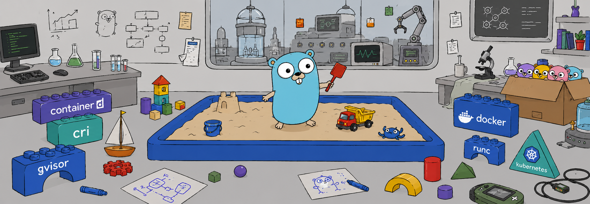
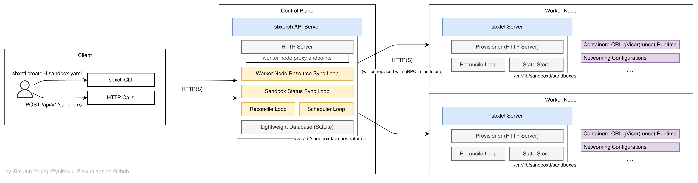
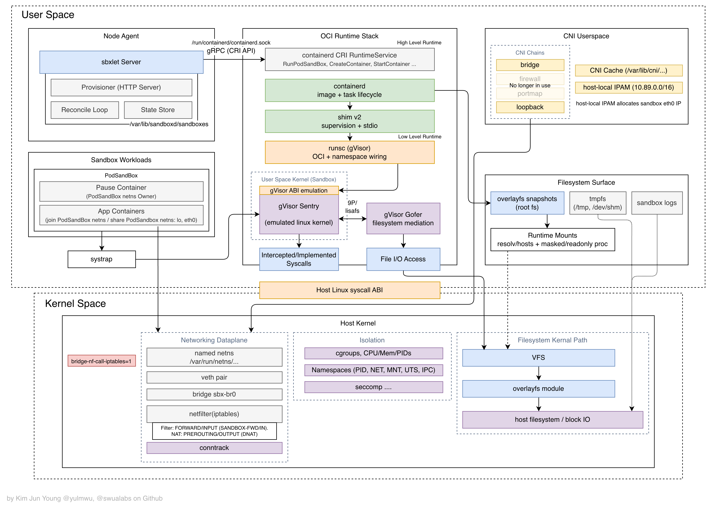
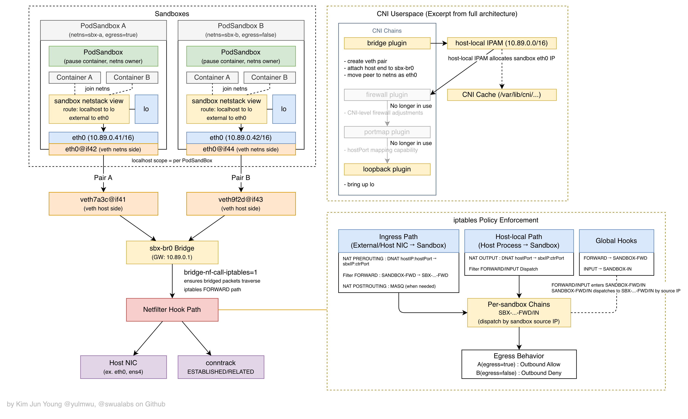
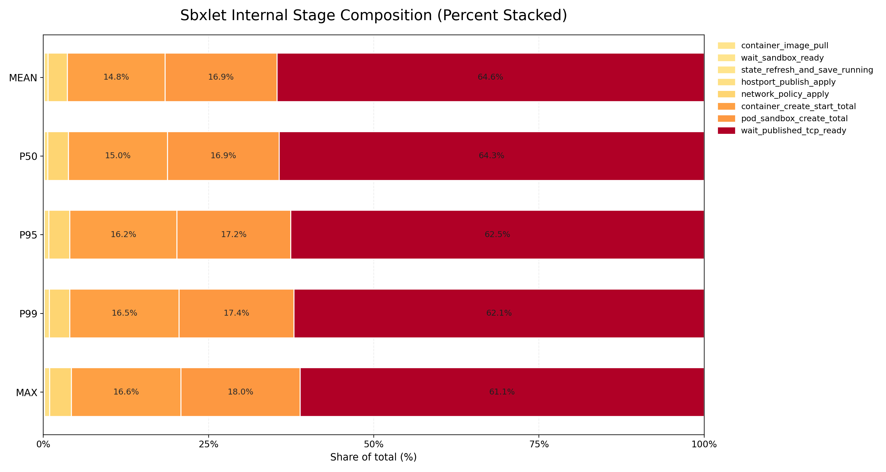
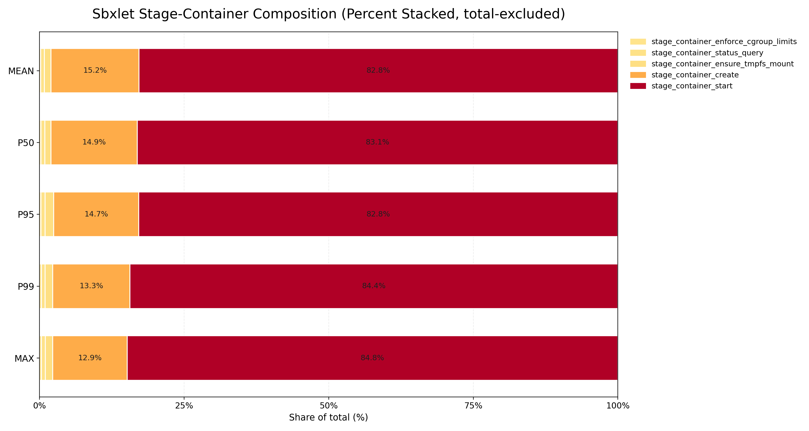
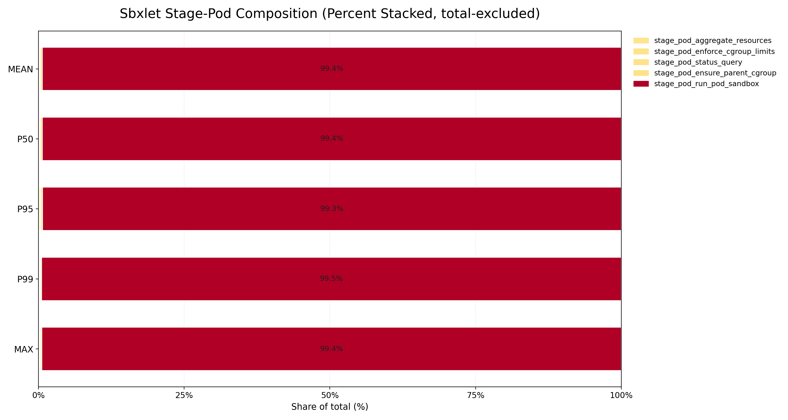
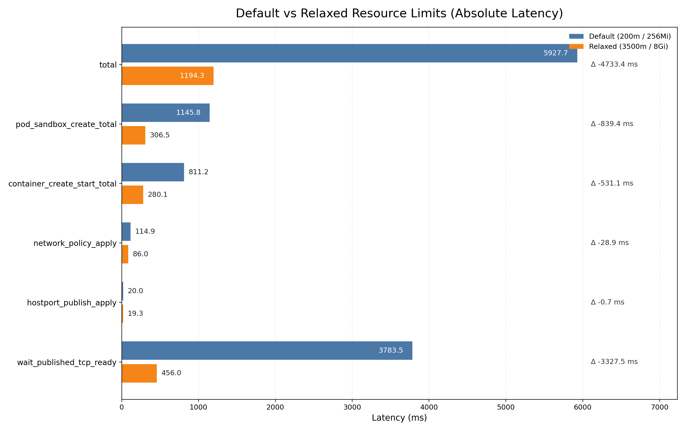
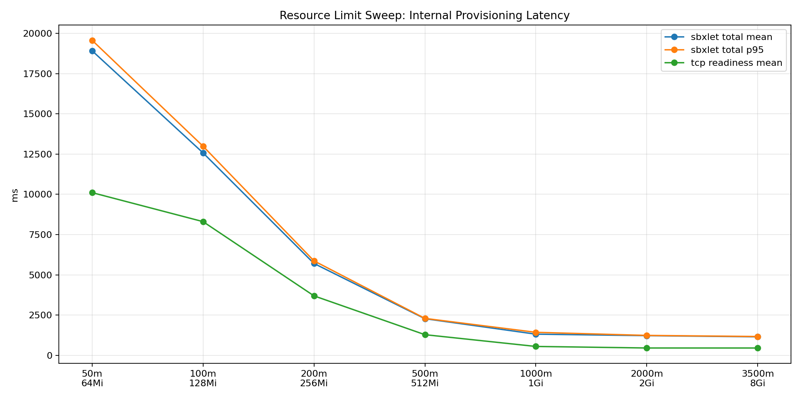
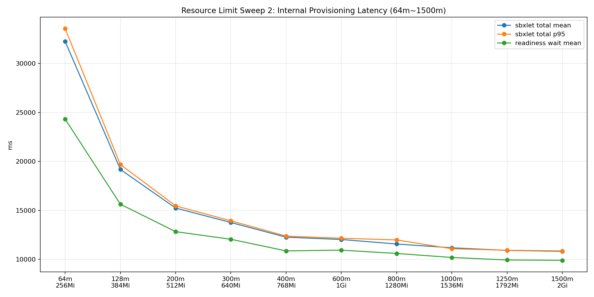

<p align="center">
  
</p>

[](https://codecov.io/github/swualabs/sandboxd-o)
[](https://github.com/swualabs/sandboxd-o/actions/workflows/backend-test-ci.yaml)

# sandboxd-o: Containerd CRI and gVisor shim based sandbox-like runtime, orchestrator

> [!WARNING]
>
> This project provides a **sandbox-like** environment, but **fundamentally operates on top of container technology**. (Containers are not a [sandbox](<https://en.wikipedia.org/wiki/Sandbox_(computer_security)>)!)
>
> Even though gVisor offers stronger isolation, there are still limitations compared to more robust isolation mechanisms such as Firecracker Micro-VMs or KVM-based virtualization.
>
> Therefore, this project should be used with those limitations in mind. It is recommended to deploy it in a dedicated computing environment (worker nodes) rather than running it alongside environments containing critical production data.
>
> While the likelihood of container escape may be low, it is important to remember that container technology does not fundamentally provide a perfectly isolated sandbox environment.

---

- [Overview](#overview)
- [About: Technical Architecture](#about-technical-architecture)
    - [Sandboxd Let(sbxlet) Runtime](#sandboxd-letsbxlet-runtime)
        - [Networking Model](#networking-model)
        - [State Management and Reconcile Loop](#state-management-and-reconcile-loop)
    - [Sandboxd Orchestrator(sbxorch)](#sandboxd-orchestratorsbxorch)
        - [HTTP Server and Database](#http-server-and-database)
        - [Sync Loops](#sync-loops)
        - [Scheduler/Reconcile Loops](#schedulerreconcile-loops)
    - [Sandboxd CLI(sbxctl)](#sandboxd-clisbxctl)
- [Resource Model/Objects](#resource-modelobjects)
    - [Node](#node)
    - [External](#external)
    - [Sandbox](#sandbox)
        - [egress, ttl_seconds, ports](#egress-ttl_seconds-ports)
        - [containers](#containers)
        - [Readiness Probe](#readiness-probe)
- [Sandbox/Container State](#sandboxcontainer-state)
- [Installation, Build and Usage](#installation-build-and-usage)
    - [Requirements](#requirements)
    - [Installation Runtime Dependencies](#installation-runtime-dependencies)
    - [Build and Usage](#build-and-usage)
- [Configuration](#configuration)
- [Testing](#testing)
- [Appendix A. Performance and Benchmarking](#appendix-a-performance-and-benchmarking)
    - [Client Baseline](#client-baseline)
    - [Sbxlet Internal Baseline](#sbxlet-internal-baseline)
    - [Sbxlet Stage (Containerd CRI)](#sbxlet-stage-containerd-cri)
    - [Compare Low vs High Resource Configurations](#compare-low-vs-high-resource-configurations)
    - [Sweep](#sweep)
    - [Discussion](#discussion)
- [Appendix B. Infrastructure Cost Comparison (vs K8s)](#appendix-b-infrastructure-cost-comparison-vs-k8s)
- [Appendix C. Reference](#appendix-c-reference)
- [Appendix D. API Documentation](#appendix-d-api-documentation)
- [Appendix E. FAQ, Troubleshooting and Best Practices](#appendix-e-faq-troubleshooting-and-best-practices)
- [Appendix F. Contribution and Contributors](#appendix-f-contribution-and-contributors)
- [Appendix G. License](#appendix-g-license)

---

# Overview

**sandboxd-o**, officially named **Sandboxd-OCI**(Open Container Initiative) or **Sandboxd-Orchestrator**, is a sandbox runtime and orchestrator built on top of **Containerd CRI** and the **gVisor shim**.

This project was developed to provide an isolated environment using container technology and serves as a replacement for the previous [Container Provisioner with Kubernetes](https://github.com/nullforu/container-provisioner-k8s).

The previous project required deploying a Kubernetes cluster, introducing unnecessary overhead simply to leverage Kubernetes orchestration capabilities.
In contrast, sandboxd-o includes orchestration functionality natively and is designed as a lightweight container-based runtime focused solely on sandbox environments.

This project is actively used as a core component of the sandbox environment(VM) in [N4U Wargame](https://github.com/nullforu/wargame) and is being developed with the goal of enabling stable operation in real production environments.

# About: Technical Architecture

This project is broadly divided into three main components. Each component is described below, and the overall architecture was designed by referencing and simplifying the structure of Kubernetes.



## Sandboxd Let(sbxlet) Runtime

This component corresponds to Kubernetes' kubelet and is deployed to each worker node as a daemon/agent responsible for provisioning and managing sandboxes and containers.

It uses gVisor as the container runtime to provide an isolated sandbox environment and manages sandboxes and networking based on PodSandbox from Containerd CRI.



To achieve the project's core goal of providing "the strongest possible isolation within practical limits," sandbox environments are built using `runsc`, the runtime of gVisor.

> [!NOTE]
>
> gVisor is a technology that strengthens isolation between containers and the host system by emulating the Linux kernel. It intercepts and handles system calls through a user-space kernel called Sentry. This prevents containers from directly interacting with the host system and improves security.
>
> In addition, gVisor uses a user-space filesystem component called Gofer to mediate container filesystem access, preventing containers from directly accessing the host filesystem.

The filesystem surface can leverage `overlayfs` to provide a sandbox filesystem isolated from the host filesystem.

This project follows the principle that once a sandbox is created, it must be treated as disposable and single-use. As a result, sharing or persisting filesystems (volumes) is not supported.

### Networking Model

Another core responsibility of sbxlet is its networking model. Internally, it uses the bridge and loopback CNI (Container Network Interface) plugins to configure bridge networking and loopback networking.

Additionally, it leverages host-local IPAM (Host-local IP Address Management) to allocate and manage IP addresses for each sandbox.

Using host-local IPAM, each sandbox is assigned a unique private IP address. The loopback CNI provides localhost networking inside the sandbox, while the bridge CNI enables communication between sandboxes.

Traffic routing is then handled using `iptables` to support host-to-sandbox access and external traffic entering through the host NIC, including forwarding and NAT (Network Address Translation).

For a more detailed flow, please refer to the architecture diagram below.



> [!NOTE]
>
> Although `firewall` and `portmap` are included in the CNI chain, they are no longer used. Their functionality has been replaced with a model that manages forwarding and NAT using `iptables`.

The default networking configuration is shown below. These values can be customized through environment variables.

- Bridge Interface: `sbx-br0`
- IPAM CIDR: `10.89.0.0/16`

### State Management and Reconcile Loop

sbxlet stores state files to manage container runtime state, typically using the following paths:

- State storage: `/var/lib/sandboxd/sandboxes`
- Lock files: `/var/lib/sandboxd/locks`

These paths can be changed through environment variables described later, but they are the recommended defaults, and changing them arbitrarily may lead to unexpected behavior.

In addition, sbxlet maintains its own Reconcile Loop independently from the orchestrator.

The Reconcile Loop periodically compares the actual container state with the persisted state files and, when inconsistencies are detected, updates the state files or removes containers if necessary.

> [!NOTE]
>
> This project follows the principle that sandboxes may terminate at any time and must never be recovered. Therefore, if a sandbox has terminated or its state file no longer exists, the Reconcile Loop removes the corresponding sandbox state information.

A single sbxlet instance is intended to run on a single node. Running multiple sbxlet instances against the same state storage or allowing concurrent access is not supported.

To interact with a running sbxlet instance, use the proxied sbxorch API or the `sbxctl` command.

As described later, you can specify the `--node` option to send API requests directly to the sbxlet instance running on a specific worker node.

However, this approach is not recommended, since it bypasses sbxorch features such as scheduling and the Reconcile Loop, and should only be used when absolutely necessary.

## Sandboxd Orchestrator(sbxorch)

This is the official orchestrator of sandboxd-o and is responsible for scheduling sandboxes onto appropriate worker nodes, allocating host ports, and handling the Reconcile loop as well as the Resource/Status Sync Loop.


### HTTP Server and Database

This component is an HTTP API server that receives and handles client requests. It also includes Admission logic for validating resource specifications (Specs). For more details about the API, refer to the [API documentation](./docs/orchestrator.md) or the Swagger documentation.

The sbxorch orchestrator supports proxied APIs that allow requests to target a specific worker node (more precisely, a specific sbxlet instance). These endpoints are available under `/api/v1/nodes/:id/...`. For additional details, refer to the orchestrator API documentation or the [sbxlet API](./docs/sandboxd.md) documentation.

The storage backend used by sbxorch to manage objects and resources is SQLite by default.

SQLite was chosen because it is a lightweight file-based database, and distributed sbxorch API server deployments are not currently within the project's scope.

By default, the database is created at `/var/lib/sandboxd/orchestrator.db` and acts as the Source of Truth for managing sandbox resources as well as resources such as Node and External.

> [!NOTE]
>
> etcd was considered during the early stages of development, but was deferred because the operational overhead and complexity were not considered appropriate for the scale of this project.
>
> Additionally, while the current implementation uses relational structures with tightly connected entities, there are plans to redesign the architecture in the future around a key-value model for a faster, simpler, and more hierarchical structure.

### Sync Loops

sbxorch internally maintains several Sync Loops to preserve system consistency and stability between sbxlet and sbxorch. The major Sync Loops are as follows:

- **Node Resource Sync Loop**: Periodically retrieves node resource status from sbxlet and stores it in the database. This information is used during scheduling to score nodes and place sandboxes onto appropriate worker nodes. Although resource allocation changes are applied logically when scheduling or removing nodes, the final resource state is reconciled and updated by this loop.

- **Sandbox Status Sync Loop**: Periodically retrieves sandbox status from sbxlet and stores it in the database. This allows sbxorch to track the state of each sandbox and detect failures, runtime issues in sbxlet, errors inside the sandbox, or other state changes, enabling it to take appropriate actions.

> [!NOTE]
>
> The interval of these loops can be adjusted through environment variables, and configuring appropriate intervals is recommended for production environments.

### Scheduler/Reconcile Loops

sbxorch generally aims to follow a model similar to Kubernetes' declarative architecture, and to support this, it includes both a Scheduler Loop and a Reconcile Loop.

The **Scheduler Loop** is responsible for detecting sandbox resources that require scheduling and assigning them to appropriate worker nodes.

When a Sandbox is created, it initially enters the `Pending` state (see below for details), which indicates that scheduling is required. The Scheduler Loop continuously detects these pending sandboxes and schedules them onto suitable nodes.

The **Reconcile Loop** periodically compares the actual system state with the resource state stored in the database. When inconsistencies are detected, it updates resource states or removes resources if necessary.

However, following this project's principle that sandboxes may terminate at any time and must not be recovered, the Reconcile Loop is currently used only as a TTL (Time To Live)-based sandbox resource cleanup mechanism rather than performing resource restoration.

> [!NOTE]
>
> The intervals for both of these loops can also be configured through environment variables, and appropriate values are recommended for production environments.

```json
{"ts":"2026-05-22T18:13:13.560811039+09:00","level":"info","msg":"scheduler tick completed","app":"orchestrator:dev","sandbox_total":0,"pending_count":0}
{"ts":"2026-05-22T18:13:15.559090911+09:00","level":"info","msg":"reconcile tick completed","app":"orchestrator:dev","sandbox_total":0,"deleting_count":0,"expired_count":0}
```

## Sandboxd CLI(sbxctl)

This is a CLI tool equivalent to Kubernetes' `kubectl`, used to communicate with the sbxorch API server to manage resource models and inspect system state.

```
sandboxd control client

Usage:
  sbxctl [command]

Available Commands:
  completion  Generate the autocompletion script for the specified shell
  create      Create resource from YAML file
  delete      Delete resource
  get         Get resources
  help        Help about any command
  logs        Get sandbox logs via orchestrator node proxy
  spec        Print resource in YAML spec form

Flags:
  -c, --config string     path to sbxctl config json (default "/var/lib/sandboxd/sbxctl_config.json")
  -h, --help               help for sbxctl
      --limit int          list limit (default 100)
      --node string        node id for proxy APIs
  -o, --output string      output format: json|yaml|wide
      --server string      orchestrator base url (config file or SBXCTL_SERVER)
      --timeout duration   request timeout (default 10s)

Use "sbxctl [command] --help" for more information about a command.
```

The main available options are as follows:

- `-c, --config`: Specifies the path to the sbxctl JSON configuration file. Default: `/var/lib/sandboxd/sbxctl_config.json`
- `--server`: Specifies the base URL of the API server. This option can also be configured through the config file or the `SBXCTL_SERVER` environment variable. For example: `http://localhost:8080`
- `--node`: Specifies the target node ID when using the Proxied API. This allows API requests to be sent directly to a specific sbxlet instance. For example: `sandboxd-node-1`
- `-o, --output`: Specifies the output format. Available options are `json`, `yaml`, and `wide`. Table output is used by default. The `logs` command always prints raw log lines.

The main available commands are as follows:

- `get`: Used to retrieve a list of resources or inspect detailed information for a specific resource. Resource types may be referenced using either their full names (`nodes`, `external`, `sandboxes`) or shorthand forms (`n`, `e`, `s`). Detailed inspection of a resource can be performed using `/` separators.
- `create`: Used to create resources from a YAML file. For example: `sbxctl create -f examples/node.yaml`
- `delete`: Used to delete resources. For example: `sbxctl delete node/sandboxd-node-1`. A specific resource must be explicitly specified.
- `logs`: Used to retrieve sandbox-level logs with each line prefixed by the container name. For example: `sbxctl logs s/sbx-wordpress-demo` returns lines such as `[app] ...` and `[db] ...`. For backward compatibility, `sbxctl logs s/sbx-wordpress-demo app` still retrieves only the `app` container logs. Use `sbxctl logs s/sbx-wordpress-demo --watch` to poll logs and print newly added lines. Internally, this command uses sbxorch's Proxied API to send requests directly to the sbxlet instance running on the target node and retrieve logs.

# Resource Model / Objects

The resource model in this project is designed to resemble Kubernetes' resource model but is simplified to better fit sandbox environments.

At this stage, advanced objects such as Deployment or DaemonSet, as well as concepts like Controllers and reconciliation-based resource management, are intentionally excluded.

The following objects are currently available:

- `sandboxd.o/v1` - `Node`
- `sandboxd.o/v1` - `External`
- `sandboxd.o/v1` - `Sandbox`

> [!NOTE]
>
> API groups exist for structural and compatibility purposes, but they do not currently provide any separate functionality.

## Node

A Node represents a worker node onto which sandboxes can be scheduled.

It is a resource used to register an installed sbxlet instance with sbxorch and contains the IP address and port information of the corresponding sbxlet instance.

```yaml
# examples/node.yaml

apiVersion: sandboxd.o/v1
kind: Node
id: sandboxd-node-1
spec:
    ip: '127.0.0.1'
    port: 8081
```

```shell
> sbxctl create -f examples/node.yaml
> sbxctl get nodes -o wide
RESOURCE: node
NAME             STATE  IP         PORT  EXTERNAL       CPU(ALLOC/USED/AVAIL)  MEM(ALLOC/USED/AVAIL)  LAST_ERROR  HEARTBEAT                       UPDATED
sandboxd-node-1  Ready  127.0.0.1  8081  host1.swua.kr  3600m/0m/3600m         14342MB/0MB/14342MB                2026-05-22T09:17:40.566923735Z  2026-05-21T02:54:11.293035905Z
```

Node status can be one of `Ready`, `NotReady`, or `Unknown`, and sandboxes can only be scheduled onto Nodes that are in the `Ready` state.

- The `Unknown` state occurs when a node has been newly registered and no Heartbeat has been received yet, or when the Threshold or Grace Period has not elapsed sufficiently to determine its status.
- The `NotReady` state occurs when a node has not sent a Heartbeat for a certain period of time, or when a Heartbeat was received but the Threshold or Grace Period conditions were not satisfied for the node to be considered `Ready`.

## External

The External object is a resource used to register a Public IP address or hostname (domain) for a node.

It does not participate in internal networking behavior, but is used as a logical representation of an externally reachable endpoint associated with a node.

```yaml
# examples/external.yaml

apiVersion: sandboxd.o/v1
kind: External
id: sandboxd-node-external-1
spec:
    node_id: 'sandboxd-node-1'
    external: 'host1.swua.kr'
```

The `node_id` field specifies the ID of the Node referenced by this External resource, and the `external` field represents the externally reachable endpoint associated with that node.

If this object is not configured, the accessible Public IP address or hostname for that node will be displayed as `(none)`.

```shell
> sbxctl get external
RESOURCE: external
ID                        NODE_ID          EXTERNAL       UPDATED
sandboxd-node-external-1  sandboxd-node-1  host1.swua.kr  2026-05-21T02:54:12.778649884Z
```

## Sandbox

A Sandbox is a resource that represents an isolated sandbox environment.

It represents a sandbox environment that is provisioned and managed by sbxlet. The following example defines a sandbox environment containing both WordPress and MySQL.

```yaml
# examples/wordpress.yaml

apiVersion: sandboxd.o/v1
kind: Sandbox
id: sbx-wordpress-demo
spec:
    egress: true
    ttl_seconds: 3600
    ports:
        - container_port: 80
          protocol: tcp
    containers:
        - name: wordpress
          image: wordpress:6.9.4-php8.3-apache
          args:
              - sh
              - -c
              - >-
                  for i in $(seq 1 90); do php -r
                  '$s=@fsockopen("127.0.0.1",3306,$e,$es,1);
                  if($s){fclose($s); exit(0);} exit(1);'
                  && break; sleep 2; done;
                  exec docker-entrypoint.sh apache2-foreground
          env:
              - WORDPRESS_DB_HOST=127.0.0.1:3306
              - WORDPRESS_DB_USER=wordpress
              - WORDPRESS_DB_PASSWORD=wordpress-pass
              - WORDPRESS_DB_NAME=wordpress
          work_dir: ''
          resource:
              cpu: 1000m
              memory: 1024Mi
        - name: mysql
          image: mysql:8.4
          args: []
          env:
              - MYSQL_DATABASE=wordpress
              - MYSQL_USER=wordpress
              - MYSQL_PASSWORD=wordpress-pass
              - MYSQL_ROOT_PASSWORD=root-pass
          work_dir: ''
          resource:
              cpu: 1000m
              memory: 1024Mi
```

The description of each field is as follows.

### egress, ttl_seconds, ports

- `egress`: Determines whether this sandbox is allowed to send outbound traffic to external networks. When set to `true`, outbound traffic from the sandbox to external networks is allowed. When set to `false`, outbound traffic is blocked. This behavior is enforced by sbxlet's networking model.

- `ttl_seconds`: The amount of time (in seconds) before the sandbox is automatically terminated after creation. If this value is `0` or not specified, the sandbox continues running until it is manually deleted. If a positive value is specified, the sandbox is automatically terminated after the configured duration has elapsed. This mechanism is implemented through the Reconcile Loop, which detects and terminates sandboxes whose TTL has expired.

- `ports`: The list of ports to expose from this sandbox. Each port consists of `container_port` and `protocol`. `container_port` specifies the port number exposed inside the sandbox, while `protocol` specifies the protocol used for that port. Currently, `tcp` and `udp` are supported. This field is optional, and if omitted, no ports are exposed.

    Direct Host Port assignment is intentionally not supported because sbxorch maintains and allocates its own Host Port Pool. Following the project's philosophy of exposing large numbers of Host Ports to arbitrary users, manual Host Port assignment has been intentionally disallowed.

> [!WARNING]
>
> `egress: false` can be useful in scenarios such as:
>
> - Intentionally preventing participants in CTF/Wargame VM environments from invoking external webhooks
> - Running sandboxes in environments where outbound access to external networks must be prohibited due to security policies or internal governance requirements
>
> However, disabling this option blocks all outbound traffic, meaning operations such as `apt-get` or application-level external API calls will no longer work.
>
> In addition, some DNS resolvers may not function properly, so you should ensure that all required packages and applications are already included in the container image and verify that the application can operate correctly without outbound network access.

Therefore, in the `wordpress.yaml` example above, the sandbox is automatically terminated by the Reconcile Loop after one hour (3600 seconds) from creation, and TCP port `80` is exposed inside the sandbox.

Additionally, since `egress` is set to `true`, outbound traffic to external networks is permitted for this sandbox.

### containers

Sandbox fundamentally follows and is built upon the PodSandbox model, and therefore consists of a Pause Container and one or more Application Containers.

The `containers` field represents the list of Application Containers included in this sandbox.

Each container is composed of `name`, `image`, `args`, `env`, `work_dir`, and `resource`.

The following is an example container specification capable of running a sample application.

```yaml
- name: my-app
  image: my-app-image:latest
  args: []
  env:
      - SECRET_KEY=supersecretkey
  work_dir: '/app'
  resource:
      cpu: 100m
      memory: 256Mi
      ephemeral_storage: 96Mi
```

- `name`: The name of the container. It must be unique within the sandbox. Rather than generating it randomly, the name is explicitly specified so that it can be configured directly by the client.

- `image`: The container image. This must be an OCI (Open Container Initiative)-compatible image reference. For example: `my-app-image:latest` or `docker.io/library/my-app-image:latest`. The implementation first attempts to use an image already available on the node, and only pulls from the registry if the image does not exist locally.

- `args`: The command and argument list executed when the container starts. For example: `["sh", "-c", "echo Hello World"]`. This field is optional, and if omitted, the container starts using the image's default command and arguments.

- `env`: A list of environment variables available inside the container. Each environment variable is represented as a string in `KEY=VALUE` format. This field is optional, and if omitted, no additional environment variables are injected.

- `work_dir`: The working directory of the container. The container switches to this directory at startup. This field is optional, and if omitted, the container uses its default working directory.

- `resource`: The resources allocated to the container. While Kubernetes typically uses a Request/Limit model, this project simplifies resource allocation by using a single resource model consisting of `cpu` and `memory`.

    In other words, this behaves similarly to Kubernetes' Guaranteed QoS model.

    `cpu` represents the CPU resources allocated to the container, and `memory` represents the memory resources allocated to the container. These values act as both Request and Limit and determine the maximum amount of resources the container can consume.

    `ephemeral_storage` is optional and controls writable filesystem limits. When set, sbxlet applies this total budget by splitting it into:
    - root writable layer (`/`) = 80%
    - temporary filesystem (`/tmp`) = 20%

    The root writable layer and `/tmp` will return `ENOSPC` when each split limit is exceeded.

    CPU values are expressed in millicores, for example `100m` represents `0.1` CPU.

    Memory values are expressed in bytes, for example `256Mi` represents 256 mebibytes (approximately 268,435,456 bytes).

    Resource enforcement is implemented using cgroups, and gVisor is custom patched, built, and used for proper enforcement.

    For more details, refer to the [Reference](#reference) section below.

> [!NOTE]
> However, in the case of `/dev/shm`, it appears that `runsc` internally mounts a separate `tmpfs`.
>
> As a result, it could not be controlled at the code level in the current implementation. Further investigation and experimentation will be conducted in the future to determine whether limits can be enforced for this mount point as well.

### Readiness Probe

Sandboxd-O supports a **Readiness Probe** feature for sandboxes.

A Readiness Probe is a mechanism used to determine whether a sandbox is ready. Until the sandbox is considered ready, external access is not allowed.

The following example demonstrates its usage, and it behaves similarly to Kubernetes' Readiness Probe model.

```yaml
apiVersion: sandboxd.o/v1
kind: Sandbox
id: sbx-nginx
spec:
    egress: true
    ttl_seconds: 3600
    ports:
        - container_port: 80
          protocol: tcp
    readiness_probe:
        protocol: http
        path: /
        port: 80
        initial_delay_seconds: 10
        period_seconds: 5
        timeout_seconds: 1
        success_threshold: 1
        failure_threshold: 5
    containers:
        - name: app
          image: nginx:latest
          args: []
          env: []
          work_dir: ''
          resource:
              cpu: 150m
              memory: 64Mi
              ephemeral_storage: 96Mi
```

- `readiness_probe`: A field used to configure the Readiness Probe. It determines whether the sandbox is considered ready. This field itself is optional, but the fields below become required once it is specified.

- `protocol`: Specifies the protocol used by the Readiness Probe. Supported values are `http` and `tcp`.
    - For the HTTP protocol, an internal HTTP GET request is performed, and the sandbox is considered ready when the response satisfies `200 <= status < 400`.
    - For the TCP protocol, an internal TCP connection attempt (`Dial`) is performed, and the sandbox is considered ready when the connection succeeds.
    - UDP is not supported due to its protocol characteristics.

- `path`: Specifies the path used by the Readiness Probe when `http` is selected. For example, setting `/healthz` sends an HTTP GET request to that endpoint inside the sandbox.

- `port`: Specifies the port that the Readiness Probe will target. This must match one of the `container_port` values defined in the `ports` field.

The following additional options control Readiness Probe behavior:

- `initial_delay_seconds`: Specifies the delay (in seconds) after sandbox creation before the first Readiness Probe execution. During this period, the sandbox is considered not ready.

- `period_seconds`: Specifies the interval (in seconds) between repeated Readiness Probe executions.

- `timeout_seconds`: Specifies the timeout (in seconds) for each probe request. If no response is received or the connection attempt fails within this duration, the attempt is treated as failed.

- `success_threshold`: Specifies the number of consecutive successful probe attempts required for the sandbox to be considered ready. For example, setting this to `1` marks the sandbox as ready after the first successful attempt.

- `failure_threshold`: Specifies the number of consecutive failed probe attempts required before the sandbox is considered not ready. For example, setting this to `5` marks the sandbox as not ready after five consecutive failures.

When a Readiness Probe is configured, the sandbox state immediately after provisioning starts as:

- `Creating` in **sbxlet**
- `Scheduled` in **sbxorch**

Once the probe succeeds and the sandbox is determined to be ready:

- sbxlet transitions the sandbox to `Running`
- sbxorch also transitions the sandbox to `Running`

If the probe fails and the sandbox is determined to be not ready:

- sbxlet transitions the sandbox to `Error`
- sbxorch transitions the sandbox to `Failed`

This means the Readiness Probe directly affects sandbox state transitions and allows access to remain blocked until the sandbox is actually ready.

If no Readiness Probe is configured, the sandbox transitions to `Running` immediately after provisioning. In such cases, even though the sandbox appears as `Running`, the application inside may not yet be fully initialized.

Therefore, using a Readiness Probe is recommended to more accurately reflect real application readiness.

> [!NOTE]
>
> This feature was introduced starting from **v0.3.0**. For more details, refer to PR #15.

## Sandbox/Container State

In sbxlet, sandboxes and containers have the following states, and each state is mapped to the corresponding sbxorch sandbox state.

- **sbxlet Sandbox states**: `Creating`, `Running`, `Deleting`, `Error`
- **sbxlet Container states**: `Creating`, `Running`, `Stopped`, `Error`, `Unknown`

The state of an sbxlet sandbox transitions to `Running` once all containers reach the `Running` state.

If any container enters the `Error` state, the sandbox transitions to `Error`. In this case, the error message is recorded in the Last Error field.

Additionally, when a sandbox is being removed, its state transitions to `Deleting`.

- **sbxorch Sandbox states**: `Pending`, `Scheduled`, `Running`, `Failed`, `Deleting`

The sandbox state in sbxorch is determined by mapping the corresponding sandbox state from sbxlet.

A sandbox is initially created in the `Pending` state, then scheduled and assigned to a node. Once the sandbox managed by sbxlet on that node reaches the `Running` state, the sandbox state in sbxorch also transitions to `Running`.

If the sandbox enters the `Error` state in sbxlet, the corresponding sbxorch sandbox transitions to `Failed`.

Likewise, when a sandbox is deleted through sbxorch, its state transitions to `Deleting`.

> [!NOTE]
>
> 만약 컨테이너별 의존성이 필요할 경우, `wordpress.yaml`의 예제와 같이 컨테이너의 `args` 필드에 커스텀 스크립트를 작성하여 의존성 체크 및 대기 로직을 구현하는 방식을 권장합니다. 예를 들어, WordPress 컨테이너가 MySQL 컨테이너에 의존성이 있는 경우, WordPress 컨테이너의 `args`에 MySQL이 준비될 때까지 대기하는 스크립트를 작성할 수 있습니다.
>
> 이는 위 Readiness Probe와는 다른 방식으로, Readiness Probe는 샌드박스의 상태를 `Running`으로 전환하기 위한 TCP Dial 또는 HTTP Get Health Check 등의 헬스 체크 메커니즘을 제공하지만, 컨테이너 간의 의존성이나 준비 상태를 직접적으로 관리하는 기능은 제공하지 않습니다.

This information can be checked using commands such as `sbxctl get sandboxes` or `sbxctl get sandboxes/:ID`, or through the API.

```shell
> sbxctl get s -o wide
RESOURCE: sandbox
NAME                PHASE    NODE             EXTERNAL       IP          PORTS          EGRESS  CONTAINERS  EXPIRE_AT                       LAST_ERROR  CREATED
sbx-wordpress-demo  Running  sandboxd-node-1  host1.swua.kr  10.89.1.35  22761/tcp->80  true    2           2026-05-22T10:45:58.249474717Z              2026-05-22T09:45:58.249474717Z

> sbxctl get s/sbx-wordpress-demo -o yaml
sandbox:
    created_at: "2026-05-22T09:45:58.249474717Z"
    id: sbx-wordpress-demo
    spec:
        containers:
            - args:
                - sh
                - -c
                - for i in $(seq 1 90); do php -r '$s=@fsockopen("127.0.0.1",3306,$e,$es,1); if($s){fclose($s); exit(0);} exit(1);' && break; sleep 2; done; exec docker-entrypoint.sh apache2-foreground
              env:
                - WORDPRESS_DB_HOST=127.0.0.1:3306
                - WORDPRESS_DB_USER=wordpress
                - WORDPRESS_DB_PASSWORD=wordpress-pass
                - WORDPRESS_DB_NAME=wordpress
              image: wordpress:6.9.4-php8.3-apache
              name: wordpress
              resource:
                cpu: 1000m
                memory: 1024Mi
            - env:
                - MYSQL_DATABASE=wordpress
                - MYSQL_USER=wordpress
                - MYSQL_PASSWORD=wordpress-pass
                - MYSQL_ROOT_PASSWORD=root-pass
              image: mysql:8.4
              name: mysql
              resource:
                cpu: 1000m
                memory: 1024Mi
        egress: true
        ports:
            - container_port: 80
              protocol: tcp
        ttl_seconds: 3600
    status:
        assigned_ports:
            - container_port: 80
              host_port: 22761
              protocol: tcp
        expire_at: "2026-05-22T10:45:58.249474717Z"
        external: host1.swua.kr
        ip: 10.89.1.35
        node_name: sandboxd-node-1
        phase: Running
    updated_at: "2026-05-22T09:46:10.588422069Z"
```

> [!NOTE]
>
> The final resource allocation of a sandbox is determined as the sum of the resources allocated to its containers. Therefore, in the example above, the sandbox is calculated to use **2 vCPUs (2000m)** and **2048Mi of memory**.

# Installation, Build and Usage

## Requirements

- **x86-64 architecture**
- **Ubuntu 24.04 LTS or later** (tested on the AWS EC2 Ubuntu 24.04 AMI)
- Go 1.25.5 or later
- Other binary versions can be checked in the install script, and all components are installed automatically.

> [!NOTE]
>
> ARM architecture is not officially supported. It may be built and used separately, but it is not officially tested or supported.

- ...and **it does not require virtualization technologies such as KVM, QEMU, or a hypervisor!** This project is built on **container technology**. While it requires the kernel version and features needed by gVisor's `runsc` runtime, it does not require separate virtualization technology.

## Installation Runtime Dependencies

This project requires runtime dependencies such as Containerd, CRI Plugins, and gVisor (`runsc`), and additionally requires CNI plugins to be configured.

It also requires runtime environment setup such as enabling certain kernel options (`bridge-nf-call-iptables`, etc.) and registering systemd services.

Additionally, the gVisor runtime shim used by this project is a custom-patched version, so the patched binary is automatically included and installed.

An installation script covering these steps is provided at [scripts/install.sh](./scripts/install.sh), and runtime dependencies can be installed using that script.

```shell
chmod +x scripts/install.sh
sudo ./scripts/install.sh
```

> [!NOTE]
>
> The installation script must be executed with sudo privileges, and it has been tested on x86-64 architecture and Ubuntu 24.04 LTS or later.

## Build and Usage

At the moment, this project can either be built directly from source or used by downloading prebuilt binaries from releases.

The following example demonstrates how to clone the source code via git and build it locally.

```shell
git clone https://github.com/swualabs/sandboxd-o.git
cd sandboxd-o

make build
```

After building, the `sbxlet`, `sbxorch`, and `sbxctl` binaries will be generated under the `./build` directory.

You can start sbxlet and sbxorch by executing these binaries with sudo privileges.

The following script demonstrates one example of running sbxlet and sbxorch in the background.

```shell
sudo install -d /var/lib/sandboxd
sudo cp configs/sbxlet_config.json /var/lib/sandboxd/sbxlet_config.json
sudo cp configs/sbxorch_config.json /var/lib/sandboxd/sbxorch_config.json

sudo ./build/sbxlet > /dev/null 2>&1 &
sudo ./build/sbxorch > /dev/null 2>&1 &
```

More detailed installation and usage guides will be provided in the future.

# Configuration

`sbxlet`, `sbxorch`, and `sbxctl` now use JSON config files by default.

- `sbxlet`: `/var/lib/sandboxd/sbxlet_config.json`
- `sbxorch`: `/var/lib/sandboxd/sbxorch_config.json`
- `sbxctl`: `/var/lib/sandboxd/sbxctl_config.json`

Each binary also accepts `--config` or `-c` to use a different path.

Environment variables are still supported as compatibility overrides, but they are no longer the recommended configuration mechanism.

## sbxlet

Example file: [`configs/sbxlet_config.json`](./configs/sbxlet_config.json)

```shell
sudo ./build/sbxlet --config /var/lib/sandboxd/sbxlet_config.json
```

## sbxorch

Example file: [`configs/sbxorch_config.json`](./configs/sbxorch_config.json)

```shell
sudo ./build/sbxorch --config /var/lib/sandboxd/sbxorch_config.json
```

## sbxctl

Example file: [`configs/sbxctl_config.json`](./configs/sbxctl_config.json)

Compatible environment variable override: `SBXCTL_SERVER`

```shell
./build/sbxctl --config /var/lib/sandboxd/sbxctl_config.json get sandboxes
```

# Testing

[](https://codecov.io/github/swualabs/sandboxd-o)

```shell
make test
# make test-cover
```

The target test coverage is at least **70%** for both overall and PATCH coverage.

However, since there are components that are difficult to test—such as sbxlet—certain exceptions are defined. Please refer to [`codecov.yaml`](./codecov.yaml) for details.

# Appendix A. Performance and Benchmarking

This section presents the benchmarking results of Sandboxd-O provisioning performance using the following specification containing a single Nginx container.

```yaml
apiVersion: sandboxd.o/v1
kind: Sandbox
id: perf-nginx
spec:
    egress: false
    ports:
        - container_port: 80
          protocol: tcp
    readiness_probe:
        protocol: http
        path: /
        port: 80
        initial_delay_seconds: 1
        period_seconds: 1
        timeout_seconds: 1
        success_threshold: 1
        failure_threshold: 99
    containers:
        - name: nginx
          image: nginx:latest
          resource:
              cpu: 500m
              memory: 512Mi
              ephemeral_storage: 128Mi
```

During the performance measurement process, the following probes were used as measurement targets. Data was collected by adding detailed timing logs for each stage inside `sbxlet`.

- `pod_sandbox_create_total`: Total time required for PodSandbox creation (including namespace setup, base networking, and runtime initialization)
- `container_create_start_total`: Total time for a single container including `CreateContainer` + `StartContainer` + state verification
- `container_image_pull`: Time spent checking image availability and attempting image pull (may be extremely small in the case of cache hits)
- `network_policy_apply`: Time required to apply sandbox firewall/isolation rules (`iptables`)
- `hostport_publish_apply`: Time required to apply Host Port DNAT rules
- `wait_sandbox_ready`: Waiting time until the runtime determines that the container has reached the `Running` state
- `wait_readiness_probe`: Time spent waiting until the Readiness Probe succeeds and sbxlet proceeds to mark the sandbox as `Running`
- `state_refresh_and_save_running`: Time required to refresh the final runtime state and persist the `Running` state

Finally, `total` represents the overall elapsed time from the moment sbxlet enters the actual provisioning function until the runtime state is stored as `Running`.

Additionally, `client_ready_ms` represents the total elapsed time from immediately before sending the `POST /api/v1/sandboxes` request from the sbxorch perspective until repeated `GET /api/v1/sandboxes/{id}` polling observes the sandbox state as `Running` (or terminal failure state).

In other words, this metric represents the provisioning latency perceived from the user/control-plane perspective.

The test was performed by repeating the same sandbox specification **45 times**, and the collected data was analyzed using **p50**, **p95**, and **p99** tail latency metrics.

## Client Baseline

| metric          |   n |      mean_ms |       p50_ms |       p95_ms |       p99_ms |       max_ms |
| --------------- | --: | -----------: | -----------: | -----------: | -----------: | -----------: |
| client_ready_ms |  45 | 18718.034532 | 18941.967529 | 19030.195312 | 19073.408203 | 19107.492676 |

> [!NOTE]
>
> The following sbxorch environment variable was used in this measurement environment:
>
> ```ini
> ORCH_STATUS_SYNC_INTERVAL=20s
> ```
>
> This means that sbxorch was configured to synchronize sandbox state from sbxlet every 20 seconds.
>
> As a result, `client_ready_ms` is measured according to sbxorch's status synchronization interval (20 seconds), which explains why the observed values were approximately around 20 seconds.
>
> This metric is based on sbxorch's perspective. In practice, when the client sends a Status GET API request, the status is updated accordingly, so the actual perceived transition time to `Running` is expected to be shorter.
>
> In fact, testing confirmed that the sandbox transitioned to `Running` and became reachable in approximately **2 seconds** (matching sbxlet's total latency), before sbxorch updated the state through its synchronization loop.

## Sbxlet Internal Baseline



| metric                         |   n |     mean_ms |      p50_ms |      p95_ms |      p99_ms |      max_ms |
| ------------------------------ | --: | ----------: | ----------: | ----------: | ----------: | ----------: |
| total                          |  45 | 2178.621589 | 2053.916593 | 2944.276319 | 3097.327348 | 3320.588127 |
| pod_sandbox_create_total       |  45 |  344.272735 |  330.796320 |  472.243653 |  649.635123 |  711.289052 |
| container_image_pull           |  45 |    0.555835 |    0.514975 |    0.973611 |    0.991320 |    1.023044 |
| container_create_start_total   |  45 |  487.206278 |  497.574547 |  634.109749 |  716.261264 |  749.595281 |
| network_policy_apply           |  45 |  150.309222 |  149.313072 |  197.676209 |  208.353703 |  226.132524 |
| wait_sandbox_ready             |  45 |    1.664390 |    1.506291 |    2.342074 |    2.573512 |    5.834114 |
| hostport_publish_apply         |  45 |   27.188316 |   23.946189 |   42.280091 |   48.185709 |   48.505696 |
| wait_readiness_probe           |  45 | 1138.231510 | 1005.326693 | 2013.692176 | 2043.987995 | 2064.558837 |
| state_refresh_and_save_running |  45 |    5.369700 |    5.502309 |    6.457015 |    6.796266 |    7.011295 |

## Sbxlet Stage (Containerd CRI)



| metric                                |   n |    mean_ms |     p50_ms |     p95_ms |     p99_ms |     max_ms |
| ------------------------------------- | --: | ---------: | ---------: | ---------: | ---------: | ---------: |
| stage_container_ensure_tmpfs_mount    |  45 |   5.244724 |   4.924421 |   8.973015 |   9.476388 |   9.643016 |
| stage_container_create                |  45 |  69.486650 |  70.458002 |  89.674067 |  96.330383 |  96.715802 |
| stage_container_start                 |  45 | 378.973056 | 392.003143 | 504.173811 | 609.396929 | 637.010683 |
| stage_container_enforce_cgroup_limits |  45 |   0.961051 |   1.031276 |   1.463898 |   2.425223 |   2.492357 |
| stage_container_status_query          |  45 |   2.935109 |   3.331555 |   4.397661 |   4.638227 |   4.982841 |
| stage_container_create_start_total    |  45 | 482.228314 | 493.870857 | 630.107004 | 712.854420 | 745.647821 |



| metric                          |   n |    mean_ms |     p50_ms |     p95_ms |     p99_ms |     max_ms |
| ------------------------------- | --: | ---------: | ---------: | ---------: | ---------: | ---------: |
| stage_pod_aggregate_resources   |  45 |   0.015076 |   0.014904 |   0.016146 |   0.016723 |   0.044544 |
| stage_pod_ensure_parent_cgroup  |  45 |   0.982889 |   0.987719 |   1.117943 |   1.138562 |   1.717180 |
| stage_pod_run_pod_sandbox       |  45 | 307.015569 | 289.886447 | 401.243166 | 599.556773 | 683.984414 |
| stage_pod_enforce_cgroup_limits |  45 |   0.502330 |   0.441017 |   0.801416 |   0.924747 |   1.116165 |
| stage_pod_status_query          |  45 |   0.505591 |   0.439205 |   0.857806 |   0.963953 |   1.038865 |
| stage_pod_create_total          |  45 | 340.123423 | 326.675724 | 468.357043 | 645.852200 | 707.446993 |

## Compare Low vs High Resource Configurations

The following graph compares the results from the baseline configuration (**200m / 256Mi**) with the higher-spec configuration (**3000m / 8Gi**).



## Sweep

In this section, we present benchmarking results obtained by provisioning the same sandbox specification **five times each** across **seven different resource configurations**, ranging from **200m / 256Mi** up to **3000m / 8Gi**.

The benchmark used the specification shown below. Since the original Nginx configuration provisioned too quickly for meaningful comparison, the following image was used instead.

```yaml
apiVersion: sandboxd.o/v1
kind: Sandbox
id: perf-sweep
spec:
    egress: false
    ports:
        - container_port: 80
          protocol: tcp
    readiness_probe:
        protocol: http
        path: /
        port: 80
        initial_delay_seconds: 1
        period_seconds: 1
        timeout_seconds: 1
        success_threshold: 1
        failure_threshold: 99
    containers:
        - name: web
          image: httpd:2.4
          resource:
              cpu: ...
              memory: ...
              ephemeral_storage: 128Mi
```



| cpu   | memory | runs | client_ready_ms_mean | client_ready_ms_p95 | total_ms_mean | total_ms_p95 | wait_readiness_probe_ms_mean | wait_readiness_probe_ms_p95 | pod_sandbox_create_total_ms_mean | pod_sandbox_create_total_ms_p95 | container_create_start_total_ms_mean | container_create_start_total_ms_p95 | network_policy_apply_ms_mean | network_policy_apply_ms_p95 | hostport_publish_apply_ms_mean | hostport_publish_apply_ms_p95 | wait_sandbox_ready_ms_mean | wait_sandbox_ready_ms_p95 | state_refresh_and_save_running_ms_mean | state_refresh_and_save_running_ms_p95 | container_image_pull_ms_mean | container_image_pull_ms_p95 |
| ----- | ------ | ---- | -------------------- | ------------------- | ------------- | ------------ | ---------------------------- | --------------------------- | -------------------------------- | ------------------------------- | ------------------------------------ | ----------------------------------- | ---------------------------- | --------------------------- | ------------------------------ | ----------------------------- | -------------------------- | ------------------------- | -------------------------------------- | ------------------------------------- | ---------------------------- | --------------------------- |
| 200m  | 256Mi  | 5    | 21201.933            | 18981.647           | 16416.674     | 15766.847    | 13027.553                    | 13169.428                   | 1000.999                         | 1188.498                        | 980.898                              | 1170.267                            | 200.309                      | 219.472                     | 31.527                         | 35.575                        | 2.772                      | 3.705                     | 3.830                                  | 5.445                                 | 0.670                        | 0.919                       |
| 500m  | 512Mi  | 5    | 18933.306            | 19011.784           | 11707.671     | 11719.316    | 10680.224                    | 10663.161                   | 327.285                          | 384.406                         | 498.121                              | 537.331                             | 140.145                      | 169.921                     | 27.755                         | 24.883                        | 1.508                      | 1.761                     | 8.016                                  | 12.724                                | 0.605                        | 0.680                       |
| 1000m | 1Gi    | 5    | 18959.392            | 18994.345           | 11351.656     | 11949.836    | 10420.365                    | 11039.037                   | 285.077                          | 287.233                         | 395.608                              | 429.625                             | 179.611                      | 183.337                     | 41.041                         | 45.896                        | 2.137                      | 1.979                     | 5.469                                  | 5.669                                 | 0.555                        | 0.635                       |
| 1500m | 2Gi    | 5    | 18928.689            | 18906.061           | 10758.871     | 10799.677    | 9857.296                     | 9883.222                    | 284.922                          | 299.824                         | 366.950                              | 383.775                             | 183.918                      | 203.932                     | 36.787                         | 45.268                        | 2.731                      | 3.340                     | 1.771                                  | 1.865                                 | 0.554                        | 0.904                       |
| 2000m | 4Gi    | 5    | 18928.480            | 18957.647           | 10759.727     | 10801.446    | 9903.016                     | 9938.695                    | 264.116                          | 272.214                         | 368.668                              | 393.849                             | 150.056                      | 171.543                     | 39.491                         | 47.820                        | 2.076                      | 2.458                     | 1.809                                  | 1.863                                 | 0.418                        | 0.448                       |
| 2500m | 6Gi    | 5    | 18913.278            | 18960.410           | 10768.598     | 10769.095    | 9961.016                     | 9994.026                    | 283.675                          | 282.587                         | 343.380                              | 352.567                             | 119.984                      | 150.648                     | 32.075                         | 40.505                        | 1.812                      | 1.719                     | 1.813                                  | 1.822                                 | 0.556                        | 0.564                       |
| 3000m | 8Gi    | 5    | 18904.753            | 19060.329           | 10721.606     | 10748.990    | 9946.710                     | 9985.840                    | 269.232                          | 263.255                         | 308.798                              | 334.199                             | 122.453                      | 119.776                     | 38.340                         | 46.761                        | 1.890                      | 2.460                     | 1.979                                  | 2.074                                 | 0.314                        | 0.317                       |

> [!NOTE]
>
> Likewise, `client_ready_ms` follows sbxorch's status synchronization interval, which is why it was measured at approximately **20 seconds**.
>
> As a result, this metric is not particularly meaningful for performance evaluation and should be treated only as a reference value. For actual provisioning performance analysis, it is more appropriate to use the `total_ms` metric.

The following shows provisioning time metrics for resource configurations ranging from the initial **64m / 256Mi** up to **1500m / 2Gi**.



| cpu   | memory | runs | client_ready_ms_mean | client_ready_ms_p95 | total_ms_mean | total_ms_p95 | wait_readiness_probe_ms_mean | wait_readiness_probe_ms_p95 | pod_sandbox_create_total_ms_mean | pod_sandbox_create_total_ms_p95 | container_create_start_total_ms_mean | container_create_start_total_ms_p95 | network_policy_apply_ms_mean | network_policy_apply_ms_p95 | container_image_pull_ms_mean | container_image_pull_ms_p95 | hostport_publish_apply_ms_mean | hostport_publish_apply_ms_p95 | state_refresh_and_save_running_ms_mean | state_refresh_and_save_running_ms_p95 | wait_sandbox_ready_ms_mean | wait_sandbox_ready_ms_p95 |
| ----- | ------ | ---- | -------------------- | ------------------- | ------------- | ------------ | ---------------------------- | --------------------------- | -------------------------------- | ------------------------------- | ------------------------------------ | ----------------------------------- | ---------------------------- | --------------------------- | ---------------------------- | --------------------------- | ------------------------------ | ----------------------------- | -------------------------------------- | ------------------------------------- | -------------------------- | ------------------------- |
| 64m   | 256Mi  | 5    | 44552.815            | 50456.955           | 32251.761     | 33555.515    | 24321.115                    | 24790.973                   | 4645.292                         | 5087.526                        | 2978.005                             | 3206.482                            | 226.729                      | 235.598                     | 0.858                        | 0.953                       | 47.941                         | 46.779                        | 4.131                                  | 5.634                                 | 3.910                      | 4.573                     |
| 128m  | 384Mi  | 5    | 38440.381            | 38677.380           | 19181.087     | 19677.163    | 15628.733                    | 16194.279                   | 1887.490                         | 2136.663                        | 1418.087                             | 1465.719                            | 188.833                      | 241.473                     | 0.774                        | 0.931                       | 28.767                         | 35.020                        | 5.093                                  | 5.345                                 | 2.158                      | 3.211                     |
| 200m  | 512Mi  | 5    | 18698.062            | 18735.332           | 15235.219     | 15460.760    | 12828.257                    | 13073.202                   | 1060.795                         | 1081.291                        | 1077.892                             | 1167.639                            | 196.593                      | 234.618                     | 1.115                        | 1.116                       | 34.064                         | 43.208                        | 5.355                                  | 5.429                                 | 2.355                      | 2.448                     |
| 300m  | 640Mi  | 5    | 18834.925            | 18865.565           | 13761.889     | 13932.861    | 12048.247                    | 12050.953                   | 629.772                          | 818.901                         | 826.332                              | 947.325                             | 204.232                      | 229.309                     | 0.744                        | 0.947                       | 26.943                         | 27.424                        | 5.393                                  | 5.610                                 | 1.673                      | 1.784                     |
| 400m  | 768Mi  | 5    | 18856.024            | 18899.073           | 12260.881     | 12371.831    | 10861.231                    | 10986.690                   | 517.968                          | 617.594                         | 632.707                              | 665.078                             | 187.306                      | 195.846                     | 0.678                        | 0.715                       | 35.510                         | 46.106                        | 5.076                                  | 5.447                                 | 1.846                      | 2.404                     |
| 600m  | 1Gi    | 5    | 18903.773            | 18965.015           | 12028.595     | 12152.140    | 10940.812                    | 11041.821                   | 325.810                          | 362.435                         | 575.783                              | 645.470                             | 132.273                      | 143.523                     | 0.608                        | 0.680                       | 27.903                         | 30.065                        | 5.520                                  | 5.552                                 | 1.858                      | 2.215                     |
| 800m  | 1280Mi | 5    | 18818.910            | 18883.067           | 11565.526     | 11984.752    | 10601.326                    | 11042.828                   | 276.507                          | 291.984                         | 452.828                              | 534.219                             | 170.300                      | 187.307                     | 0.609                        | 0.726                       | 37.013                         | 45.128                        | 4.602                                  | 5.136                                 | 2.559                      | 3.002                     |
| 1000m | 1536Mi | 5    | 18856.507            | 18864.181           | 11179.475     | 11081.915    | 10191.833                    | 9992.137                    | 342.176                          | 387.094                         | 375.443                              | 368.430                             | 193.452                      | 205.708                     | 0.615                        | 0.869                       | 41.179                         | 46.633                        | 5.447                                  | 6.665                                 | 2.721                      | 3.218                     |
| 1250m | 1792Mi | 5    | 18885.384            | 18980.821           | 10913.947     | 10928.295    | 9935.708                     | 9964.596                    | 335.752                          | 348.697                         | 408.990                              | 426.969                             | 161.214                      | 180.381                     | 0.706                        | 0.922                       | 40.588                         | 48.257                        | 3.068                                  | 3.089                                 | 2.845                      | 2.600                     |
| 1500m | 2Gi    | 5    | 18855.397            | 18893.716           | 10816.679     | 10862.563    | 9899.840                     | 9934.223                    | 303.800                          | 320.247                         | 387.655                              | 399.730                             | 160.988                      | 185.320                     | 0.572                        | 0.624                       | 38.036                         | 48.348                        | 1.831                                  | 1.998                                 | 2.407                      | 2.993                     |

## Discussion

- Using the baseline resource configuration (**500m / 512Mi**) and an Nginx container, sandbox provisioning was observed to complete in approximately **2 seconds**. This represents the total provisioning latency, including container runtime initialization, network configuration, and readiness probe waiting time.

- In the **Sbxlet Internal Baseline** measurements, the stage with the highest latency was `wait_readiness_probe`, which represents the waiting period until the readiness probe succeeds. This is directly related to the time required for the container to become actually ready and may vary depending on readiness probe configuration and runtime specifications.

- In the **Resource Sweep** measurements, a downward trend was observed as resource specifications increased. Under the current specification and environment, the most significant improvement occurred in the transition from **200m / 256Mi** to **500m / 512Mi**, while provisioning time did not decrease significantly beyond the **1500m / 2Gi** range.

- Additionally, using the httpd container benchmark, the largest reduction in provisioning time was observed when moving from **128m / 384Mi** to **200m / 512Mi**. Beyond approximately **400m / 768Mi**, provisioning time no longer decreased substantially. This suggests that there may be a minimum resource threshold required for the runtime to prepare containers efficiently.

> [!WARNING]
>
> The results above assume a **Warm Cache** state for container images. Under **Cold Cache** conditions, significantly higher latency may occur during the image pull stage.
>
> In addition, actual provisioning time may vary depending on runtime behavior, networking configuration, and readiness probe settings. Therefore, these results should be treated only as reference measurements for the specific environment and specifications tested.

# Appendix B. Infrastructure Cost Comparison (vs K8s)

In this section, we use one real-world use case to compare infrastructure costs between replacing [container-provisioner-k8s](https://github.com/nullforu/container-provisioner-k8s?utm_source=chatgpt.com) with Sandboxd-O in [SMCTF](https://github.com/nullforu/smctf?utm_source=chatgpt.com) and its associated infrastructure.

SMCTF is a CTF platform where `container-provisioner-k8s` was originally used to provision VM (Stack) containers on top of a Kubernetes cluster.

However, this introduced unnecessary Kubernetes complexity, operational overhead, and overengineering. In practice, Kubernetes-level functionality was not actually required, and its networking model did not align well with the intended sandbox architecture. (Sandboxes neither needed to communicate with one another nor should have been allowed to.)

For this reason, Sandboxd-O was developed and adopted as a replacement for `container-provisioner-k8s`, and the SMCTF infrastructure was redesigned accordingly.

More details can be found in the repositories below:

- [smctf](https://github.com/nullforu/smctf?utm_source=chatgpt.com)
- [smctf-infra-v2](https://github.com/nullforu/smctf-infra-v2?utm_source=chatgpt.com) (and the previous [smctf-infra based on container-provisioner-k8s](https://github.com/nullforu/smctf-infra?utm_source=chatgpt.com))

The example below demonstrates how infrastructure costs changed after the migration (that is, comparing `smctf-infra` and `smctf-infra-v2`).

> [!NOTE]
>
> The example assumes:
>
> - MAU: **10,000 users**
> - AWS region: **Seoul (`ap-northeast-2`)**
> - Costs are approximate and may not be exact.
>
> Shared infrastructure costs excluded from both environments:
>
> - RDS
> - ElastiCache
> - S3
> - ECR
> - CloudWatch
> - Data transfer / Internet egress charges

The following hourly prices are rough estimates for comparison purposes and may differ depending on discounts (SP, RI, EDP), taxes, and actual usage.

- EKS control plane: `$0.10 / hour`
- NAT Gateway hourly: `$0.045 / hour`
- ALB hourly (base): `$0.0225 / hour`
- ALB LCU: `$0.008 / LCU-hour` (example assumption)
- EC2 `t3a.medium` (`ap-northeast-2`): `$0.0468 / hour`
- Fargate (Linux/x86): since exact Seoul pricing should be taken from the console or calculator, this report uses **conservative estimates**
    - `vCPU-hour ~= $0.050`
    - `GB-hour ~= $0.0055`

Traffic and capacity assumptions:

- Low average load with peak increases during certain periods
- Average backend demand equivalent to **1–2 running tasks**
- Peaks reaching **3–4 running tasks**

**v1 (K8s / EKS)**

- Backend nodes: `t3a.medium ×2` (always running)
- Stack nodes: `t3a.medium ×2` (minimum reserved headroom)
- Total: **4 EC2 instances + EKS control plane**

**v2 (Sandboxd-O)**

- Sandbox workers: `t3a.medium ×2` (always running)
- Sandbox control plane: `t3a.medium ×1` (always running)
- Backend: Fargate tasks (`1 vCPU / 2GB`) with autoscaling

Cost calculation formulas:

- Monthly Cost:

$$
\text{Monthly Cost} = \text{Hourly Cost} \times 730
$$

- Task Hourly Cost:

$$
Task\ Hourly\ Cost = (vCPU \times vCPUPrice) + (MemoryGB \times GBPrice)
$$

Using this report's assumptions (`1 vCPU`, `2GB`):

$$
(1 \times 0.050) + (2 \times 0.0055)
$$

$$
= 0.061\ \text{USD/hour/task}
$$

Based on these assumptions:

**v1 (K8s / EKS)**

- EC2 (4 instances):

$$
4 \times 0.0468 \times 730 = 136.66
$$

- EKS control plane:

$$
0.10 \times 730 = 73.00
$$

- ALB (hourly + 1 LCU):

$$
(0.0225 + 0.008) \times 730 = 22.27
$$

- NAT Gateway (hourly):

$$
0.045 \times 730 = 32.85
$$

**Total: `264.78 USD/month` (~ `397,170 KRW/month`)**

**v2 (Sandboxd-O)**

- EC2 (3 instances):

$$
3 \times 0.0468 \times 730 = 102.50
$$

- Fargate backend (average 1.2 tasks):

$$
0.061 \times 730 \times 1.2 = 53.44
$$

- ALB (hourly + 1 LCU):

$$
22.27
$$

- NAT Gateway (hourly):

$$
32.85
$$

**Total: `211.06 USD/month` (~ `316,590 KRW/month`)**

This results in an absolute reduction of **53.72 USD/month**, corresponding to approximately **20.3% cost savings**, showing that v2 reduces infrastructure cost compared to v1.

In particular, one major factor is that v1 incurred unnecessary fixed costs for the Kubernetes control plane, whereas in v2 the backend moved to the serverless Fargate platform with autoscaling, enabling cost optimization based on actual usage.

That said, this comparison is not exact and includes many variables such as real traffic patterns, reliability requirements, and different operational goals. Therefore, decisions should not be made based solely on cost, but should also consider overall system design, operational complexity, and whether the architecture satisfies actual requirements.

# Appendix C. Reference

- [swualabs/gvisor-shim-patched](https://github.com/swualabs/gvisor-shim-patched) : This is a patched version of the gVisor shim modified to resolve issues related to cgroup resource limit enforcement. for more details, refer to commit [`041e28d`](https://github.com/swualabs/gvisor-shim-patched/commit/041e28d) in the corresponding fork repository or [swualabs/sandboxd-o PR #11](https://github.com/swualabs/sandboxd-o/pull/11).

# Appendix D. API Documentation

REST API documentation can be found in [docs/orchestrator.md](./docs/orchestrator.md) or [docs/sandboxd.md](./docs/sandboxd.md), and Swagger documentation is available at the following endpoints:

- **sbxorch API Swagger Documentation**: `http://<sbxorch-address>/swagger/index.html`
- **sbxlet API Swagger Documentation**: `http://<sbxlet-address>/swagger/index.html`

# Appendix E. FAQ, Troubleshooting and Best Practices

# Appendix F. Contribution and Contributors

| Name          | GitHub                                     | Role                              |
| ------------- | ------------------------------------------ | --------------------------------- |
| Kim Jun Young | [@yulmwu](https://github.com/yulmwu)       | Author, Maintainer                |
| BYTE256       | [@byte16384](https://github.com/byte16384) | Vulnerability Reporter/Researcher |
| ...           | ...                                        | ...                               |

# Appendix G. MIT License

```
Copyright (c) 2026 The Swua Labs Authors, Kim Jun Young as @yulmwu

Permission is hereby granted, free of charge, to any person obtaining a copy of this software and associated documentation files (the “Software”), to deal in the Software without restriction, including without limitation the rights to use, copy, modify, merge, publish, distribute, sublicense, and/or sell copies of the Software, and to permit persons to whom the Software is furnished to do so, subject to the following conditions:

The above copyright notice and this permission notice shall be included in all copies or substantial portions of the Software.

THE SOFTWARE IS PROVIDED “AS IS”, WITHOUT WARRANTY OF ANY KIND, EXPRESS OR IMPLIED, INCLUDING BUT NOT LIMITED TO THE WARRANTIES OF MERCHANTABILITY, FITNESS FOR A PARTICULAR PURPOSE AND NONINFRINGEMENT. IN NO EVENT SHALL THE AUTHORS OR COPYRIGHT HOLDERS BE LIABLE FOR ANY CLAIM, DAMAGES OR OTHER LIABILITY, WHETHER IN AN ACTION OF CONTRACT, TORT OR OTHERWISE, ARISING FROM, OUT OF OR IN CONNECTION WITH THE SOFTWARE OR THE USE OR OTHER DEALINGS IN THE SOFTWARE.
```
